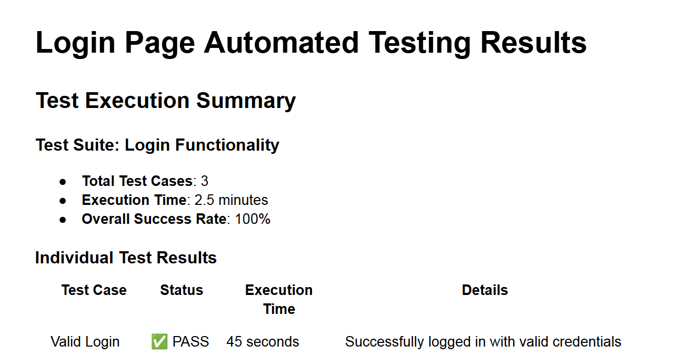

# 🤖 AI in Software Engineering – Week 4 Project

Welcome to our comprehensive exploration of AI applications in modern software engineering! This project showcases both theoretical understanding and hands-on implementation of AI-driven tools to enhance software development efficiency, accuracy, and fairness.

## 📘 Overview

This project is part of an academic assignment aimed at applying Artificial Intelligence across multiple domains of Software Engineering, including:

- AI code generation (e.g., GitHub Copilot)
- Automated testing using AI-enhanced frameworks
- Predictive analytics for resource allocation
- Ethical analysis of model bias and fairness
- Innovation in tooling for real-world software challenges

---

## 🧠 Part 1: Theoretical Analysis (30%)

### 🔹 Short Answer Questions
We explored:
- How AI tools like GitHub Copilot reduce dev time (and their limitations)
- Supervised vs. unsupervised learning in bug detection
- Why bias mitigation is crucial in UX personalization

### 🔹 Case Study Analysis
**Article Reviewed**: *AI in DevOps: Automating Deployment Pipelines*  
📈 **Key Takeaway**: AIOps enhances deployment by:
- Predicting potential rollbacks via anomaly detection
- Dynamically allocating compute resources using usage trends

---

## 💻 Part 2: Practical Implementation (60%)

### ✨ Task 1: AI-Powered Code Completion
- 🔧 Tool Used: GitHub Copilot
- 🐍 Python Function: Sort list of dictionaries by a key
- 🔍 Comparison: AI-generated vs manual implementation
- 📊 Analysis: Efficiency, readability, and performance discussed

### 🧪 Task 2: Automated Testing with AI
- ⚙️ Tool: Selenium IDE + AI Plugin
- ✅ Task: Login page testing with valid/invalid credentials
- 📷 Output: Test results captured + explained
- 📈 Summary: AI expanded test coverage and reduced effort

### 📊 Task 3: Predictive Analytics for Resource Allocation
- 📂 Dataset: Kaggle Breast Cancer Dataset
- 🧹 Preprocessing: Label encoding, cleaning, and splitting
- 🌲 Model: Random Forest Classifier
- 📈 Metrics: Accuracy + F1-score evaluation
- 📓 Deliverable: Full Jupyter Notebook with visuals

---

## ⚖️ Part 3: Ethical Reflection (10%)

### 💬 Reflection Prompt
ethical concerns?

📌 Addressed:
- Dataset biases (e.g., underrepresented groups or teams)
- Fairness tools (e.g., IBM AI Fairness 360) for mitigating discrimination

---

## 🚀 Bonus Task (Optional +10%)

### 💡 Innovation Proposal: 🧾 AutoDoc.AI
An AI-powered tool to generate real-time documentation from codebases.  
It uses:
- NLP to summarize functions
- Contextual embedding to track codebase evolution
- Markdown/HTML outputs for dev teams

🔗 **Impact**: Saves dev time ⏱, improves onboarding 📘, and reduces human error 🛑

---

## 🛠 Tech Stack

- Python 🐍
- Jupyter Notebook 📓
- GitHub Copilot ✨
- Selenium IDE 🧪
- Random Forest (scikit-learn) 🌲
- Kaggle datasets 📊

---

---

## Screenshots




## 📦 contributors

1. Aron Kipkurui   aronidengeno@gmail.com
2. Catherine Olwal- ahendaolwal@gmail.com
3. Ouma Emmanuel- emmanuelouma2000@gmail.com
4. Margaret Nungari Mungai- maggienungari.mn@gmail.com
5. Effie Otieno - effieauma0@gmail.com

## 📦 Setup Instructions

```bash
# Clone the repo
git clone https://github.com/olwal2025/ai-software-engineering-week4
cd ai-software-engineering-week4

# Set up virtual environment
python -m venv venv
source venv/bin/activate  # or venv\Scripts\activate on Windows

# Install dependencies
pip install -r requirements.txt


